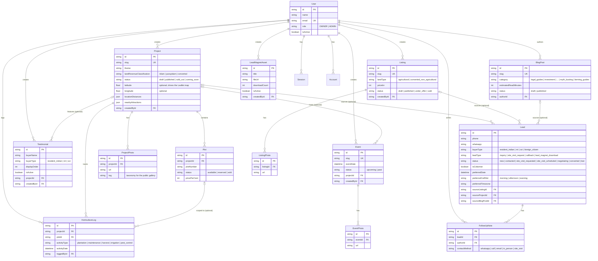

# Ghats Arcade - Data Model / ERD

Formalized from [prj.md](../prj.md) Section 8. The authoritative schema is
[`prisma/schema.prisma`](../prisma/schema.prisma); this diagram is kept in sync as it evolves.

## Notes

- SQLite has no native enums or scalar lists, so enum-like fields are `String` (allowed
  values documented inline) and lists (`photos`, `follow_up_notes`) are relations.
- JSON columns (`locationDistances`, `nearbyAttractions`) use Prisma's native `Json` scalar,
  which requires Prisma ≥ 6.2 on SQLite.
- Money is stored as integers (whole rupees / paise-free) to avoid floating-point issues
  (`priceInr` on Listing, `pricePerCent` on Plot).
- `BlogPost.body` and the rich-text `description` fields hold author-entered content; project
  and event descriptions are sanitised HTML, while blog bodies are rendered as plain text.
- `HorticultureLog` is gated under the `project:manage` permission (it is a project sub-record).
- Auth tables (`Session`, `Account`, `Verification`) follow Better Auth's expected shape.
- **Lead phone deduplication** is enforced in application code (`captureLead` in `src/server/leads.ts`), not via a DB unique index: repeat submissions from the same normalised phone merge into the existing row (canonical storage as `+{digits}`).
