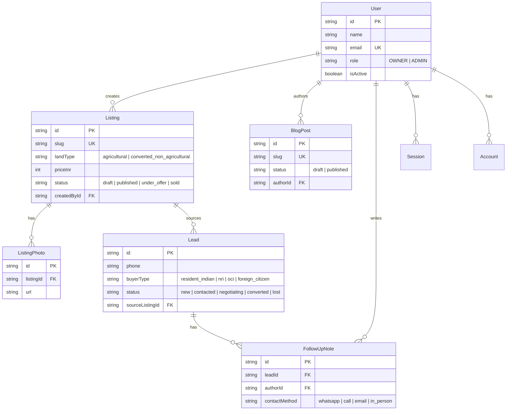

# Ghats Arcade - Data Model / ERD

Formalized from [prj.md](../prj.md) Section 8. The authoritative schema is
[`prisma/schema.prisma`](../prisma/schema.prisma); this diagram is kept in sync as it evolves.

## Notes

- SQLite has no native enums or scalar lists, so enum-like fields are `String` (allowed
  values documented inline) and lists (`photos`, `follow_up_notes`) are relations.
- Money is stored as `priceInr` (`Int`, whole rupees) to avoid floating-point issues.
- Auth tables (`Session`, `Account`, `Verification`) follow Better Auth's expected shape.
